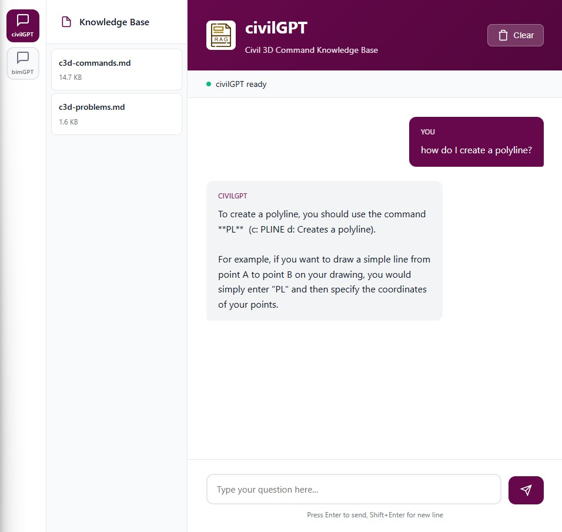
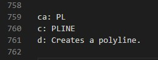
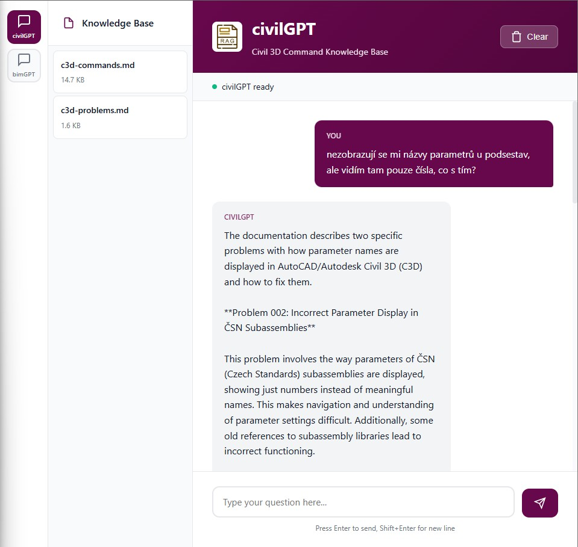
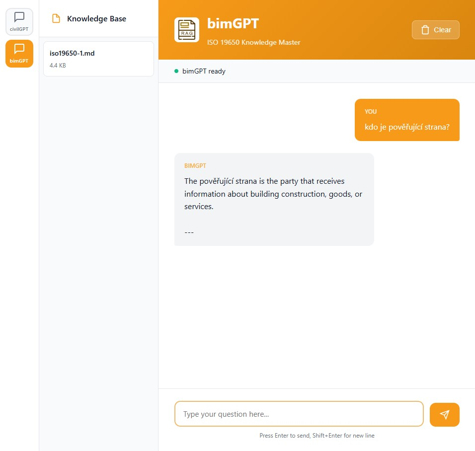

# RAG Chatbot Concept

A modular RAG (Retrieval-Augmented Generation) chatbot that answers questions based on custom knowledge bases.

The idea is to run everything locally, so all data stays securely on your computer and never leaves to the internet. The system provides answers — even at this early concept stage — strictly based on the supplied context only. This makes it possible to work (and chat) with private company data while maintaining privacy and producing reliable results.

## How It Works

1. **Source of Truth**: Markdown files stored in `modules/{module}/files/`
2. **Chunking**: Documents are split into semantic chunks during database build
3. **Embeddings**: Chunks are converted to vectors using `nomic-embed-text` model
4. **Vector Store**: ChromaDB stores embeddings locally in `modules/{module}/chroma/`
5. **Retrieval**: User questions are matched against stored vectors to find relevant chunks
6. **Generation**: Retrieved context is passed to LLM which generates the answer

## Active Models

| Component | Model | Notes |
|-----------|-------|-------|
| LLM | gemma2:2b | Runs locally via Ollama (1.6 GB) |
| Embeddings | nomic-embed-text | Runs locally via Ollama (274 MB) |
| Reranker | cross-encoder/ms-marco-MiniLM-L-6-v2 | Optional, improves retrieval accuracy |

## Current Modules

| Module | Name | Purpose |
|--------|------|---------|
| module_b | civilGPT | Civil 3D Command Knowledge Base |
| module_c | bimGPT | ISO 19650 Knowledge Master |

## Key Settings

Settings are defined per-module in `modules/{module}/config.py`:

- `SIMILARITY_TOP_K`: Number of chunks retrieved (default: 5-7)
- `ENABLE_RERANKING`: Use cross-encoder to rerank results
- `MAX_CHUNK_SIZE`: Maximum characters per chunk (1000-1200)
- `DISTANCE_METRIC`: l2, cosine, or ip

## Project Structure

```
concept/
├── modules/                    # Knowledge base modules
│   ├── module_b/
│   │   ├── files/              # Source markdown files
│   │   ├── chroma/             # Vector database (auto-generated)
│   │   ├── config.py           # Module settings
│   │   └── prompt_template.py  # Custom prompt
│   └── module_c/
├── rag/                        # RAG implementation
│   ├── config.py               # Module registry
│   ├── rag_langchain.py        # Core RAG logic
│   └── build_all_modules.py    # Database builder
├── web_app/                    # Flask web interface
└── run_webapp.py               # Entry point
```

## Quick Start

Prerequisites: Python 3.13+, Ollama installed and running

```bash
# Install dependencies
pipenv install

# Pull required models
ollama pull nomic-embed-text
ollama pull gemma2:2b

# Build vector databases
pipenv run python -m rag.build_all_modules --reset

# Start web app
pipenv run python run_webapp.py
```

Open http://localhost:5000

## Adding Content

1. Add markdown files to `modules/{module}/files/`
2. Rebuild database: `pipenv run python -m rag.build_all_modules --reset`
3. Restart web app

## Adding a New Module

1. Create `modules/module_x/files/` and `modules/module_x/chroma/`
2. Add `config.py` and `prompt_template.py` (copy from existing module)
3. Register in `rag/config.py`
4. Add UI button in `web_app/templates/index.html`
5. Build: `pipenv run python -m rag.build_all_modules --modules module_x`

## Demo

### civilGPT

Demo of civilGPT - answering a question about creating a polyline.


Context references stored in plain-text format before converted into vector database.


Another demo — this one focuses on `c3d-problems.md` instead of only `c3d-commands.md`.


### bimGPT

bimGPT demo — responding to a simple query.

